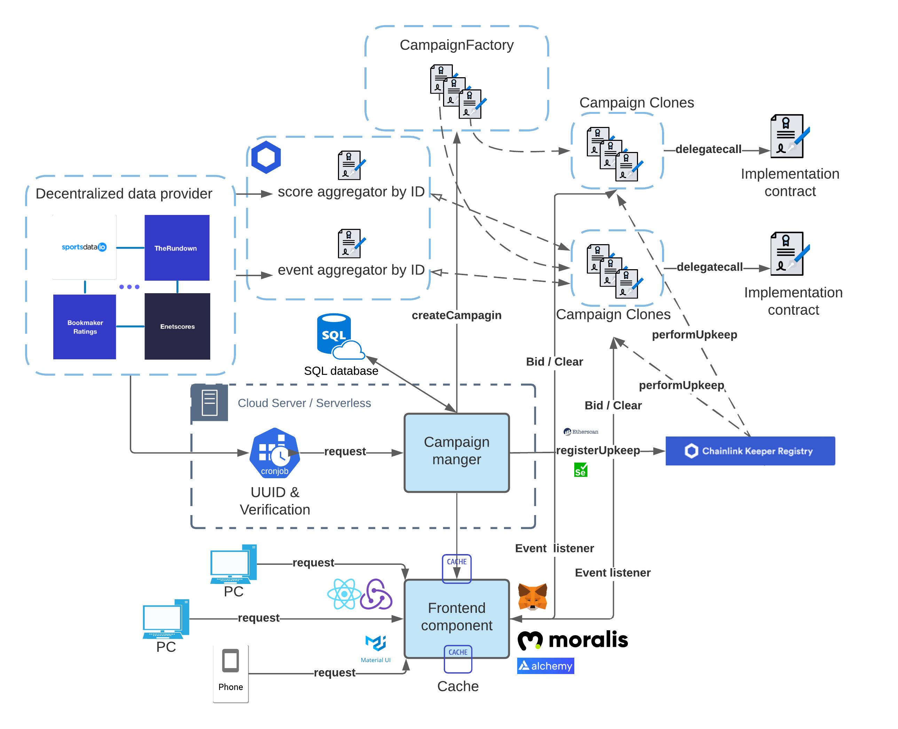

# Themis, a decentralized sports betting operator

## Architecture diagram

## Highest priority TODOs:
- [ ] More decentralization (never ever enough): Contribute or lead the initiation to build a multi-source sports data feeds that's updated by decentralized oracle network through [Chainlink's decentralized data model](https://docs.chain.link/docs/architecture-decentralized-model/), and aggregate them through aggregator, it's going to be pretty similar to the exisitng price data one. That's really one of the main things we are going to focus on.
- [ ] Tuning and refine betting model, more customization, more risk control, wiser odds-adjusting, incentive-staking-pool, off-chain auto-hedging through trusted hardware like SGX or zero-knowledge proof to enable more risk taking etc. How current betting model works: [draft](https://www.overleaf.com/read/dkqrftktbrnv)

## Quick Command: 
Run tests: 
```bash
npm test
```
Make code look nicer:
```bash
npm run prettier-format
```
In the root directory, deploy campaignFactory to kovan:
```bash
truffle migrate --reset --network kovan -f 2 --to 2 
```
